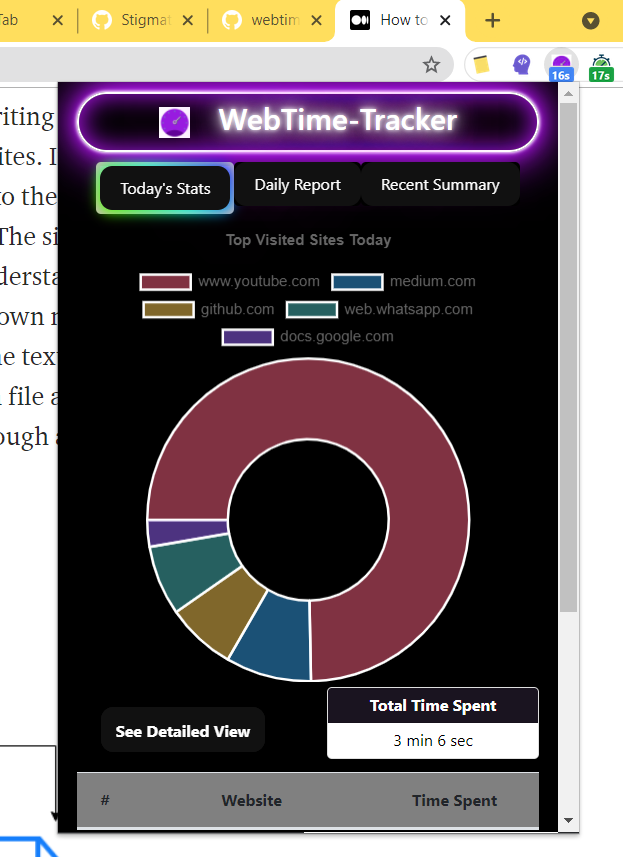
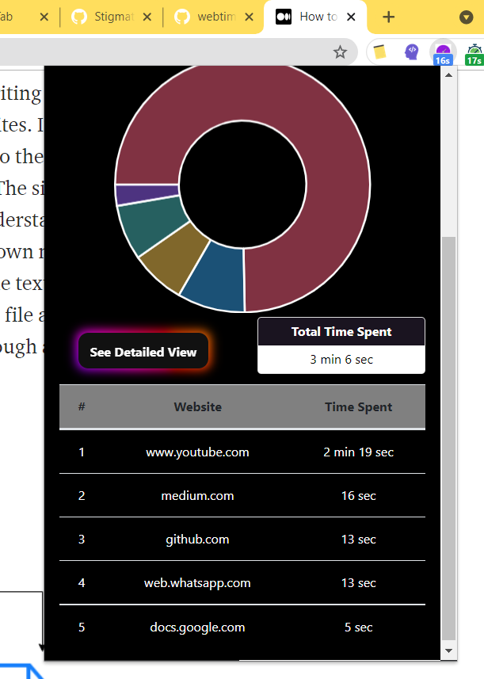
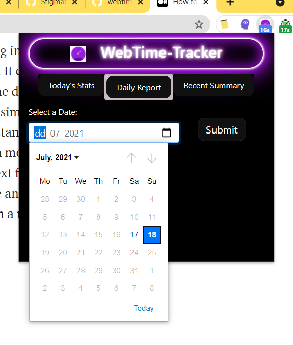
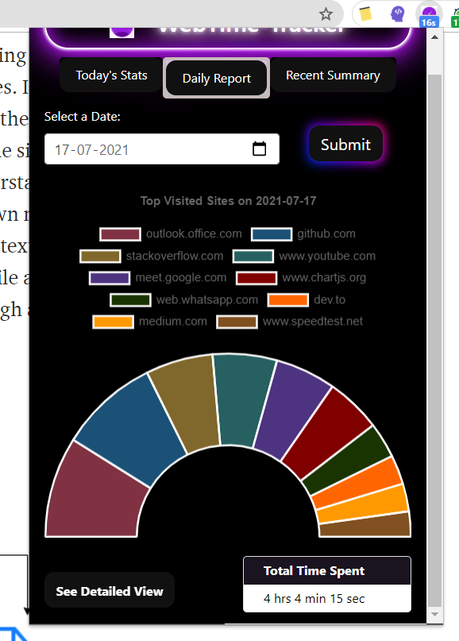
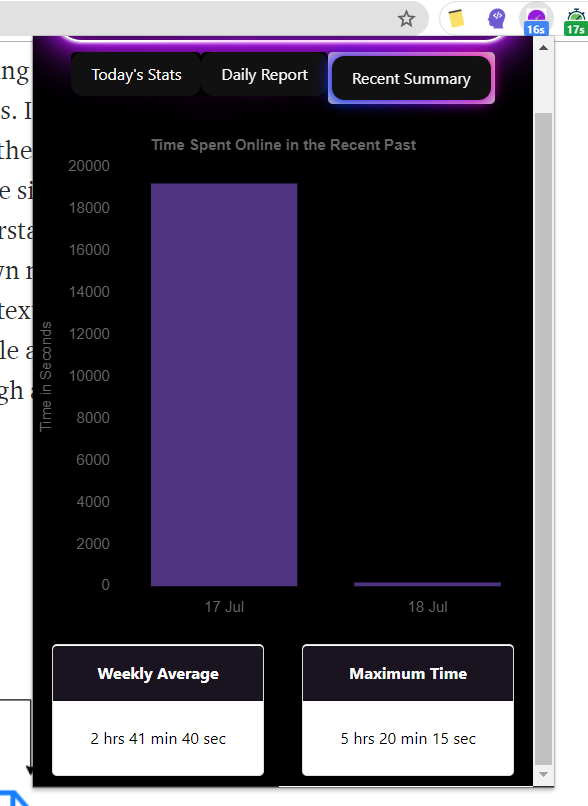

# Web-Time Tracker 
  
---
A Chrome Extension that presents you the detailed information about the time you have on different websites,each day using charts and tables.
This Extension uses only local [chrome.storage API](https://developer.chrome.com/docs/apps/manifest/storage/) chrome.storage API to store data and it does't send data anywhere.

## Installation
1. git clone https://github.com/GuruSaiKumar/WebTime-Tracker.git
2. Open [chrome://extensions/](chrome://extensions/) in your Chrome browser and enable **Developer mode** on the top right corner.
3. Click on **Load unpacked** and select the location of source folder.

## Features 
* Displays time spent on each site _today_ with a pie-chart.   
* Detailed view of all sites visited today.   
* Choice to select any valid date   
* Statistics of a given date   
* Summary of time spend for the past week with a _bar-graph_.    
